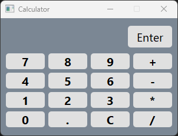

# GUI Calculator

## Inhalt

* [Beschreibung](#Beschreibung)
* [Besonderheiten](#Besonderheiten)
* [Screenshot](#Screenshot)
* [Installation](#Installation)


## Beschreibung

Dies ist ein GUI-Taschenrechner, der mit Python und PyQt6 geschrieben wurde. Er kann einfache Rechnungen durchführen und hat eine einfache und intuitive Benutzeroberfläche. Der Taschenrechner kann sowohl per GUI als auch per Tastatur bedient werden.


## Besonderheiten

* Input-History
* alle Rechenoperationen des Math-Moduls von Python (sin, cos, tan, log, exp, sqrt, ...)
* eval() sicherheit (keine Ausführung von Code z.b. ```eval("__import__("os").system("rm -rf /")")``` dank block-liste)
* Floating-Point-Error-Handling (0,1+0,2=0,3 statt 0,30000000000000004)
* Automatischer Download erforderlicher Packages, wenn nötig
* Interkompatibel mit so gut wie allem, wodrauf Python läuft (Windows, Linux, Mac, Raspberry Pi, Android, ...)

## Screenshot




## Installation

1. Installiere Python 3.9 oder neuer
2. main.py ausführen
3. Das Programm wird automatisch alle erforderlichen Packages installieren
4. Fertig!

## Lizenz

Der Code ist unter der [MIT-Lizenz](http://opensource.org/licenses/MIT) veröffentlicht.